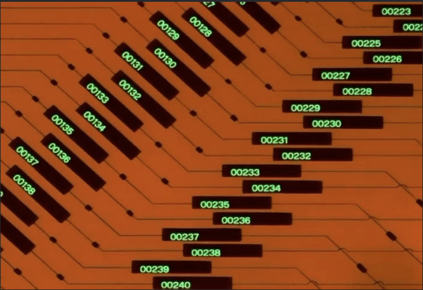
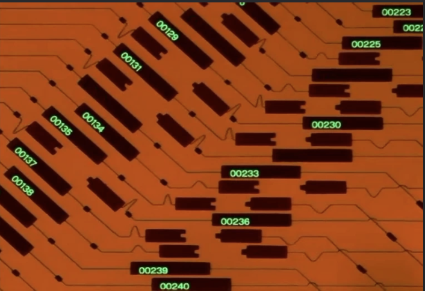

This Project's Philosophy
---


(more example gifs: https://imgur.com/a/evangelion-user-interfaces-gifs-uDeBs)

Neon Genesis Evangelion is a sci-fi anime from 1995 that promises more than it executes on plot but over-delivers on its vision for future graphical interfaces.

Maybe graphics are meant not only to be informative and easy to understand, but also grip an emotion of some kind.  





gifsicle -O3 evangelion_ui_comp.gif -o evangelion_ui_comp_optimized.gif

Python Setup
---
```bash
python -m venv .venv

source .venv/bin/activate

pip install -r requirements.txt

pip list
```